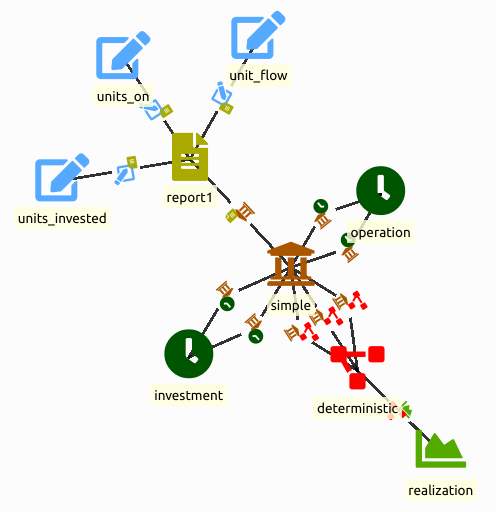
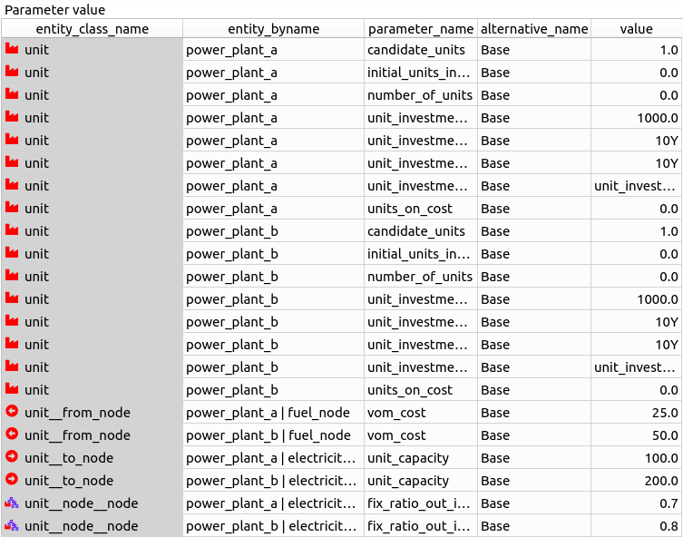

# Capacity Planning Tutorial

This tutorial provides a step-by-step guide to include investment constraints for capacity planning in a simple energy system with Spine Toolbox for SpineOpt. There is more information to be found in the documentation on [investment optimization](https://spine-tools.github.io/SpineOpt.jl/latest/advanced_concepts/investment_optimization/). To get the most out of this tutorial, we suggest first completing the [Simple System tutorial](https://spine-tools.github.io/SpineOpt.jl/latest/tutorial/simple_system/).

## Overview

In this tutorial we will:
+ start from the simple system tutorial,
+ change the temporal structure from days to months,
+ add a temporal block for investments,
+ and add investment related parameters for the units.

## Spine Toolbox

Create a new workflow in Spine Toolbox, as you did for the simple system tutorial. In the input database, we import the simple system tutorial (File > import).

## temporal structure

For the investment optimization, let us consider a more appropriate time horizon, e.g. 2030-2035. We set the `model_start` and `model_end` parameters accordingly.

We'll consider a monthly operation so we'll set the resolution of the exiting temporal block to `1M`. For clarity we also change the name from `flat` to `operation`.

For the investment period we'll have to add another temporal block called `investment`. We connect it to the model entity with the `model__temporal_block` and `model__default_investment_temporal_block`. The resolution is to be set to `5Y`.

!!! info
  Instead of a default connection to the model entity, we can also make the investment temporal block specific to a part of the energy system, e.g. with the [unit\_\_investment\_temporal\_block](@ref) entity.

In principle we also need to define the default investment stochastic structure. To that end, we can simply connect the existing stochastic structure to the model entity using the `model__default_investment_stochastic_structure` entity.

## unit investment parameters

With the infrastructure for investments in place, we can now ready units for the investment optimization. Let's focus on power plant b:
- Set the [number\_of\_units](@ref) parameter to zero so that the unit is unavailable unless invested in.
- Set the [initial\_units\_invested\_available](@ref) to zero as well.
- Set the [candidate\_units](@ref) parameter for the unit to 100 to specify that a maximum of 100 new unit of this type may be invested in by the model.
- Set the unit's investment cost by setting the [unit\_investment\_cost](@ref) parameter to 1000.0.
- Specify the [unit\_investment\_tech\_lifetime](@ref) of the unit to, say, 5 years to specify that this is the minimum amount of time this new unit must be in existence after being invested in.
- Specify the [unit\_investment\_econ\_lifetime](@ref) to automatically adjust the investment costs. Let's set it equal to the technical lifetime here.
- Specify the [unit\_investment\_variable\_type](@ref) to `unit_investment_variable_type_integer` to specify that this is a discrete [unit](@ref) investment decision. By default this is set to continuous and we would see an investment of 0.25 units in the solution. That also shows that unit size is set by the `unit_capacity` parameter of the `unit__to_node` entity (`200*0.25=50` which equals the flow).

!!! info
  Investments in storage and connections are very similar. Note that storage is implemented through nodes.

## examine output

To be able to see the investments in the results, we'll have to add some more output entities to the report entity, i.e. `units_invested` and `units_invested_available`. Commit the changes to the input data base and run the SpineOpt tool. In the output you should now also find the investments. The value should be equal to 1.0 unit.