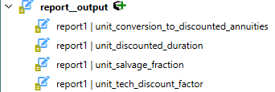

# Multi-year investments tutorial

This tutorial provides a guide to model multi-year investments in a simple energy system with Spine Toolbox for SpineOpt.

## Introduction

Welcome to our tutorial, where we will walk you through the process of modeling multi-year investments in SpineOpt using Spine Toolbox. To get the most out of this tutorial, we suggest first completing the Simple System tutorial, which can be found [here](https://spine-tools.github.io/SpineOpt.jl/latest/tutorial/simple_system/).

Multi-year investments refer to making investment decisions at different points in time, such that a pathway of investments can be modeled. This is particularly useful when long-term scenarios are modeled, but modeling each year is not practical. Or in a business case, investment decisions are supposed to be made in different years which has an impact on the cash flow.

In this tutorial, we consider two investment points, at the start of the modeling horizon (2030), and 5 years later (2035). Operation is assumed to be monthly, but only in 2030 and 2035. In other words, we only model 2030 and 2035 as milestone years for the pathway 2030 - 2035.   

Did you finish the Simple System tutorial? Then you are ready to go.

## Overview of the set up

The below picture give an overview of all the parameters and relationships you will need in this tutorial. We will discuss some topics in detail in the following sections. First, we will define the modelling horizon and demands. Second, we will talk about defining the temporal blocks, creating investment candidates, and providing investment costs.

### Defining the model horizon

As mentioned, we want to model 2030 and 2035, so the model needs to start on 2030-01-01 and end on 2036-01-01.

### Adding demands

Next, we should add demand data for the operational blocks, i.e., for every month in 2030 and 2035. Choose parameter type _Time series variable resolution_, put 100 for every month in 2030, and 400 for every month in 2035. In between, we add an addition entry for 2034-12-01, and put 0 there. The rationale for the extra entry will be explained shortly in the coming section about temporal blocks. 

Note we also change the parameters _fix_ratio_out_in_unit_flow_ to 1 to make it easier when inspecting the outputs.

## Defining the temporal blocks

We would need three temporal blocks, one for investment, and two for operation. 

Investment temporal block is a continuous temporal block starting from the beginning of the model horizon till the end, so only _resolution_ needs to be defined. _5Y_ indicates that we allow investment in 2030 and in 2035.

Operation temporal blocks are non-continuous, in 2030 and in 2035, respectively. This means that we do not model the in-between years, which greatly reduces the model size. That being said, it is perfectly fine if you make _one_ continuous operation temporal block instead, i.e., from 2030 - 2035 at the cost of a larger model. 

!!! note
    Very important to mention that at the beginning of the second operation block, we start at 2034-12-01 which is 1 time slice before the actual start date we want (i.e., 2035-01-01). 

    This is because, on the one hand, SpineOpt needs this extra time slice to correctly generate the constraints for the first time slice of the second operation block. In fact, if the operational blocks are non-consecutive, we need to do it for every operation block, except for the first one. One the other hand, you may want some boundary conditions for the second operation block, e.g., the initial storage level or the initial online status for units. You can choose to define these boundary conditions at this extra time slice. We do not yet support linking the boundary conditions with the previous operation temporal block. 

    This additional definition means that we will also have results for it, which is redundant and should be ignored when post-processing. 

After defining these temporal blocks, we have to make sure they are used by SpineOpt. This means we have to put all the operation blocks in `model__default_temporal_block`, and the investment block in `model__default_investment_temporal_block`.

!!! note 
    It is important to delete the temporal blocks that are not used, and only leave the used ones. Otherwise, the temporal structure may be wrong.

 
## Creating investment candidates

Remember that our previously built simple system concerns only operation without any investments, now we need to add investment possibilities. The general steps for creating a candidate unit can be found [here](https://spine-tools.github.io/SpineOpt.jl/latest/advanced_concepts/investment_optimization/).  

We will allow investments for power\_plant\_a in both 2030 and 2035, and for power\_plant\_b only in 2035. This is realised through the definition of `candidate_units`. We define a time-varying `candidate_units` as follows.

- power\_plant\_a: [2030: 1, 2035: 2]. Note this means in 2030, 1 unit can be invested, and in 2035, another 1 **(instead of 2)** can invested. In other words, this parameter includes the previously available units.
- power\_plant\_b: [2030: 0, 2035: 1].

## Providing investment costs

Specify your unit investment cost by setting the `unit_investment_cost` parameter. In this tutorial, for illustrative purposes, we only give a constant value. It is important to mention that normally, you should use the discounted cost. In this example, the costs in 2030 and in 2035 should be discounted to the discount year, i.e., you would define a time-varying cost to reflect the economic representation. SpineOpt allows the users to give any parameter they would need, according to their wishes.

## Checking outputs
For convenience, you may want to add some variables to the report as below, which is the last thing before running the model. 

Now you can run the model.

We can check the results for power\_plant\_a first. The below pictures show that in 2030, there is 1 investment, and in 2035, there is another investment. In 2035, there are 2 units on.

Note we notice a drop between the two periods for operation variables, _units_on_ in this case, because it is a redundant result.

We also get 1 investment for power\_plant\_b in 2035.

