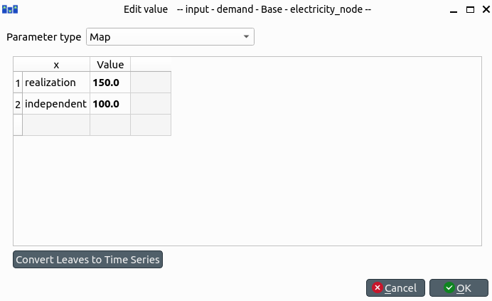

# Stochastic System tutorial

Welcome to Spine Toolbox's Stochastic System tutorial.

This tutorial provides a step-by-step guide to get started with the stochastic structure.
More information can be found in the [documentation on the stochastic structure](@ref stochastic_framework).
It is recommended to make sure you are able to get the simple system tutorial working first.

In this tutorial we will take a look at independent scenarios, DAG stochastic structures
and specific different stochastic structures in different parts of the energy system.

## Setup starting from simple system tutorial

We create a new Spine Toolbox project and start from the simple system tutorial.

For the Spine Toolbox project
- Open Spine Toolbox
- Create a new Spine Toolbox project
- Add two data store items (input and output)
    - set the dialect to sqlite
    - push the new database button
- Add the run SpineOpt tool
    - connect the databases to the SpineOpt tool
    - in the properties pane of the SpineOpt tool,
    move the available resources to the tool arguments

For the simple system tutorial
- Download the simple system database (json file)
from the examples folder in the SpineOpt repository
(you can save the json file in your Spine Toolbox project folder)
- Enter the input database such that you are in the spine db editor
- Go to the hamburger menu (Alt+F) and select import
- Locate the downloaded file to import the simple system
- We save our results when we commit to the database,
so go again to the hamburger menu and select commit.
The update message can be something like this: import simple system tutorial.

!!! note
    The graph view is not always enabled by default. If you want to see the simple system,
    go to the hamburger menu and select graph.

## Independent scenarios
Recall from the simple system tutorial that there actually already is a stochastic structure present.
Let us take a closer look at that structure.

The scenarios are the labels that are available to the user to label their data.
Don't worry, we'll come back to that later.
Here, there is currently one scenario *realization*.

The scenarios are managed by the stochastic structure.
Foremost, the stochastic structure is connected to the model with the
*model\_\_stochastic_structure* relationship.
The stochastic structure is also connected to different parts of the energy system
to manage the stochastic structure in these parts.
With the *model\_\_default_stochastic_structure* relationship we can connect the scenario
to the entire energy system.
Here, there is one stochastic structure *deterministic* which is also the systems default.

It is quite simple to add an independent scenario to this existing stochastic structure.
- Add a *scenario* object and call it 'independent'
- Add a *stochastic\_structure\_\_stochastic\_scenario* relationship between *independent* and *deterministic*
either from the tree view (right click -> new relationship) or from the graph view (right click -> add relationship)

Now we can use these labels in the values for the energy system.
- Change the *demand* parameter at the *electricity\_node* from 150.0 to a map
(right click -> edit, parameter type map)
- for the *x* column we can use our scenario labels, for the *Value* column we can choose our values
- Choose realization 150.0 and independent 100.0
- Save/Commit the results

That is it! We can now run the model and the output database will show the results for both scenarios.
In the realization scenario power plant b produces an output of 50.
In the independent scenario power plant b does not produce anything
as the demand is low enough for power plant a to produce all the necessary energy.

## DAG stochastic structures

## Different stochastic structures