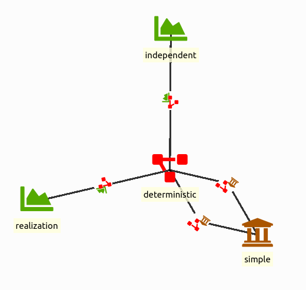
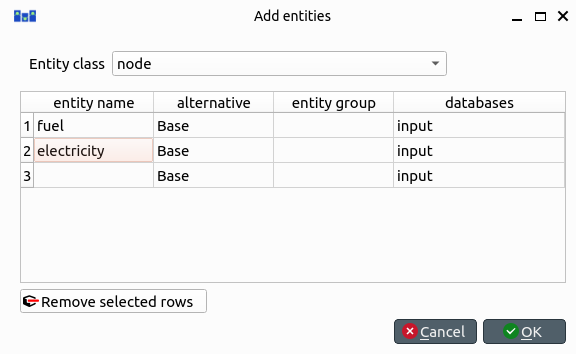
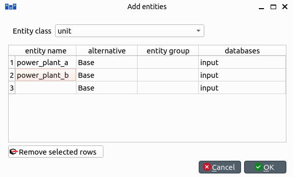
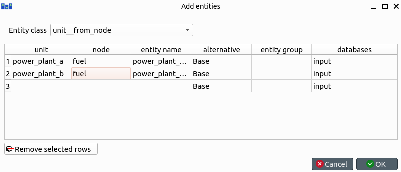
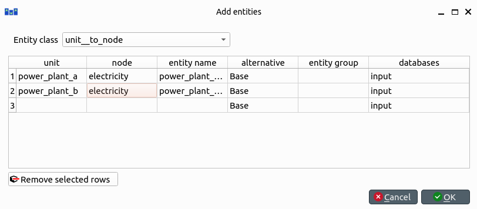
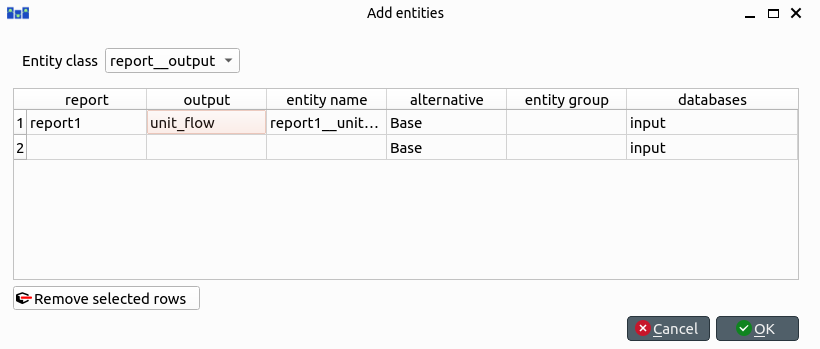

# Simple System tutorial

Welcome to Spine Toolbox's Stochastic System tutorial.

This tutorial provides a step-by-step guide to get started with the stochastic structure.
More information can be found in the [documentation on the stochastic structure](@ref stochastic_framework).
It is recommended to make sure you are able to get the simple system tutorial working first.

In this tutorial we will take a look at independent scenarios, DAG stochastic structures
and specific different stochastic structures in different parts of the energy system.

## Setup starting from simple system tutorial

We create a new Spine Toolbox project and start from the simple system tutorial.

For the Spine Toolbox project
- Open Spine Toolbox
- Create a new Spine Toolbox project
- Add two data store items (input and output)
    - set the dialect to sqlite
    - push the new database button
- Add the run SpineOpt tool
    - connect the databases to the SpineOpt tool
    - in the properties pane of the SpineOpt tool,
    move the available resources to the tool arguments

For the simple system tutorial
- Download the simple system database (json file)
from the examples folder in the SpineOpt repository
(you can save the json file in your Spine Toolbox project folder)
- Enter the input database such that you are in the spine db editor
- Go to the hamburger menu (Alt+F) and select import
- Locate the downloaded file to import the simple system
- We save our results when we commit to the database,
so go again to the hamburger menu and select commit.
The update message can be something like this: import simple system tutorial.

!!! note
    The graph view is not always enabled by default. If you want to see the simple system,
    go to the hamburger menu and select graph.

## Independent scenarios
Recall from the simple system tutorial that there actually already is a stochastic structure present.
Let us take a closer look at that structure.

The scenarios are the labels that are available to the user to label their data.
Don't worry, we'll come back to that later.
Here, there is currently one scenario *realization*.

The scenarios are managed by the stochastic structure.
Foremost, the stochastic structure is connected to the model with the
*model\_\_stochastic_structure* relationship.
The stochastic structure is also connected to different parts of the energy system
to manage the stochastic structure in these parts.
With the *model\_\_default_stochastic_structure* relationship we can connect the scenario
to the entire energy system.
Here, there is one stochastic structure *deterministic* which is also the systems default.

It is quite simple to add an independent scenario to this existing stochastic structure.
- Add a *scenario* object and call it 'independent'
- Add a *stochastic\_structure\_\_stochastic\_scenario* relationship between *independent* and *deterministic*
either from the tree view (right click -> new relationship) or from the graph view (right click -> add relationship)

Now we can use these labels in the values for the energy system.
- Change the *demand* parameter at the *electricity\_node* from 150.0 to a map
(right click -> edit, parameter type map)
- for the *x* column we can use our scenario labels, for the *Value* column we can choose our values
- Choose realization 150.0 and independent 100.0
- Save/Commit the results

That is it! We can now run the model and the output database will show the results for both scenarios.
In the realization scenario power plant b produces an output of 50.
In the independent scenario power plant b does not produce anything
as the demand is low enough for power plant a to produce all the necessary energy.

## DAG stochastic structures

## Different stochastic structures

### Entering input data

#### Importing the SpineOpt database template

-   Download [the SpineOpt database
    template](https://raw.githubusercontent.com/spine-tools/SpineOpt.jl/master/templates/spineopt_template.json)
    and [the basic SpineOpt
    model](https://raw.githubusercontent.com/spine-tools/SpineOpt.jl/master/templates/models/basic_model_template.json)
    (right click on the links, then select *Save link as...*)

-   Select the 'input' Data Store item in the *Design View*.

-   Go to *Data Store Properties* and hit **Open editor**. This will
    open the newly created database in the *Spine DB editor*, looking
    similar to this:

!!! note
    The *Spine DB editor* is a dedicated interface within Spine Toolbox
    for visualizing and managing Spine databases.

-   Press **Alt + F** to display the main menu, select **File ->
    Import...**, and then select the template file you previously
    downloaded (*spineopt\_template.json*). The contents of
    that file will be imported into the current database, and you should
    then see classes like 'commodity', 'connection' and 'model' under
    the root node in the *Object tree* (on the left). Then import the
    second file (*basic\_model\_template.json*).

-   From the main menu, select **Session -> Commit**. Enter 'Import
    SpineOpt template' as message in the popup dialog, and click
    **Commit**.

!!! note
    The SpineOpt basic template contains (i) the fundamental entity classes
    and parameter definitions that SpineOpt recognizes and expects; and (ii)
    some predefined entities for a common deterministic model with a 'flat'
    temporal structure.

#### Creating objects

-   Always in the Spine DB editor, locate the *Object tree* (typically
    at the top-left). Expand the [root] element if not
    expanded.

-   Right click on the [node] class, and select *Add
    objects* from the context menu. The *Add objects* dialog will pop
    up.

-   Enter the names for the system nodes as seen in the image below,
    then press *Ok*. This will create two objects of class
    *node*, called *fuel\_node* and
    *electricity\_node*.

-   Right click on the *unit* class, and select *Add
    objects* from the context menu. The *Add objects* dialog will pop
    up.

!!! note
    In SpineOpt, nodes are points where an energy balance takes place,
    whereas units are energy conversion devices that can take energy from
    nodes, and release energy to nodes.

-   Enter the names for the system units as seen in the image below,
    then press *Ok*. This will create two objects of class
    *unit*, called *power\_plant\_a* and
    *power\_plant\_b*.

!!! note
    To modify an object after you enter it, right click on it and select
    **Edit...** from the context menu.

#### Establishing relationships

-   Always in the Spine DB editor, locate the *Relationship tree*
    (typically at the bottom-left). Expand the *root*
    element if not expanded.

-   Right click on the *unit\_\_from\_node* class, and select
    *Add relationships* from the context menu. The *Add relationships*
    dialog will pop up.

-   Select the names of the two units and their **sending** nodes, as
    seen in the image below; then press *Ok*. This will establish that
    both *power\_plant\_a* and *power\_plant\_b*
    take energy from the *fuel\_node*.

-   Right click on the *unit\_\_to_node* class, and select
    *Add relationships* from the context menu. The *Add relationships*
    dialog will pop up.

-   Select the names of the two units and their **receiving** nodes, as
    seen in the image below; then press *Ok*. This will establish that
    both *power\_plant\_a* and *power\_plant\_b*
    release energy into the *electricity\_node*.

-   Right click on the *report\_\_output* class, and select
    *Add relationships* from the context menu. The *Add relationships*
    dialog will pop up.

-   Enter *report1* under *report*, and
    *unit\_flow* under *output*, as seen in the image below;
    then press *Ok*. This will tell SpineOpt to write the value of the
    *unit\_flow* optimization variable to the output
    database, as part of *report1*.

!!! note
    In SpineOpt, outputs represent optimization variables that can be
    written to the output database as part of a report.

#### Specifying object parameter values

-   Back to *Object tree*, expand the *node* class and
    select *electricity\_node*.

-   Locate the *Object parameter* table (typically at the top-center).

-   In the *Object parameter* table (typically at the top-center),
    select the *demand* parameter and the *Base*
    alternative, and enter the value *100* as seen in the
    image below. This will establish that there's a demand of '100'
    at the electricity node.

-   Select *fuel\_node* in the *Object tree*.

-   In the *Object parameter* table, select the
    *balance\_type* parameter and the *Base*
    alternative, and enter the value *balance\_type\_none* as
    seen in the image below. This will establish that the fuel node is
    not balanced, and thus provide as much fuel as needed.

#### Specifying relationship parameter values 

-   In *Relationship tree*, expand the *unit\_\_from\_node*
    class and select *power\_plant\_a | fuel\_node*.

-   In the *Relationship parameter* table (typically at the
    bottom-center), select the *vom\_cost* parameter and the
    *Base* alternative, and enter the value *25*
    as seen in the image below. This will set the operating cost for
    *power\_plant\_a*.

-   Select *power\_plant\_b | fuel\_node* in the *Relationship
    tree*.

-   In the *Relationship parameter* table, select the
    *vom\_cost* parameter and the *Base*
    alternative, and enter the value *50* as seen in the
    image below. This will set the operating cost for
    *power\_plant\_b*.

-   In *Relationship tree*, expand the *unit\_\_to_node*
    class and select *power\_plant\_a | electricity\_node*.

-   In the *Relationship parameter* table, select the
    *unit\_capacity* parameter and the *Base*
    alternative, and enter the value *100* as seen in the
    image below. This will set the capacity for
    *power\_plant\_a*.

-   Select *power\_plant\_b | electricity\_node* in the
    *Relationship tree*.

-   In the *Relationship parameter* table, select the
    *unit\_capacity* parameter and the *Base*
    alternative, and enter the value *200* as seen in the
    image below. This will set the capacity for
    *power\_plant\_b*.

-   In *Relationship tree*, select the
    *unit\_\_node\_\_node* class, and come back to the
    *Relationship parameter* table.

-   In the *Relationship parameter* table, select *power\_plant\_a |
    electricity\_node | fuel\_node* under *object name list*,
    *fix\_ratio\_out\_in\_unit\_flow* under *parameter name*,
    *Base* under *alternative name*, and enter
    *0.7* under *value*. Repeat the operation for
    *power\_plant\_b*, but this time enter *0.8*
    under *value*. This will set the conversion ratio from fuel to
    electricity for *power\_plant\_a* and
    *power\_plant\_b* to *0.7* and
    *0.8*, respectively. It should like the image below.

When you're ready, commit all changes to the database.

### Executing the workflow

-   Go back to Spine Toolbox's main window, and hit the **Execute
    project** button  from the tool bar. 
    You should see 'Executing All Directed Acyclic Graphs' printed in
    the *Event log* (at the bottom left by default).

-   Select the 'Run SpineOpt 1' Tool. You should see the output from
    SpineOpt in the *Julia Console*.

### Examining the results

-   Select the output data store and open the Spine DB editor.
-   Press **Alt + F** to display the main menu, and select **Pivot ->
    Index**.
-   Select
    *report\_\_unit\_\_node\_\_direction\_\_stochastic\_scenario*
    under **Relationship tree**, and the first cell under
    **alternative** in the *Frozen table*.
-   Under alternative in the Frozen table, you can choose results from
    different runs. Pick the run you want to view. If the workflow has
    been run several times, the most recent run will usually be found at
    the bottom.
-   The *Pivot table* will be populated with results from the SpineOpt
    run. It will look something like the image below.
