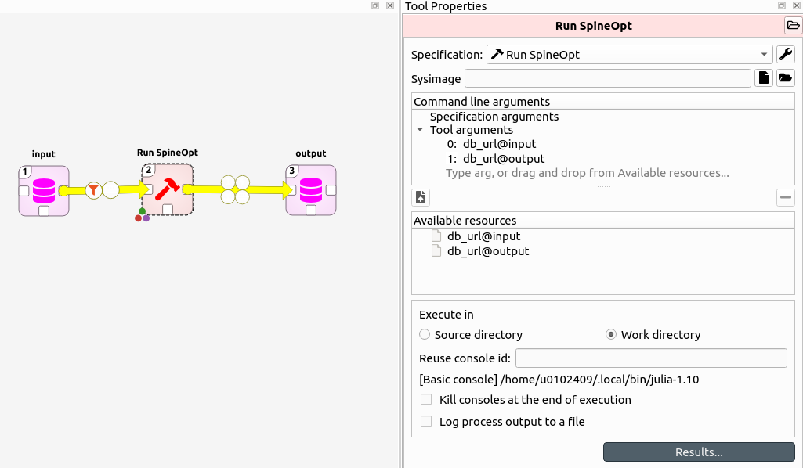
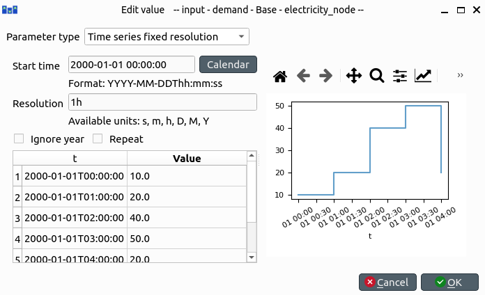
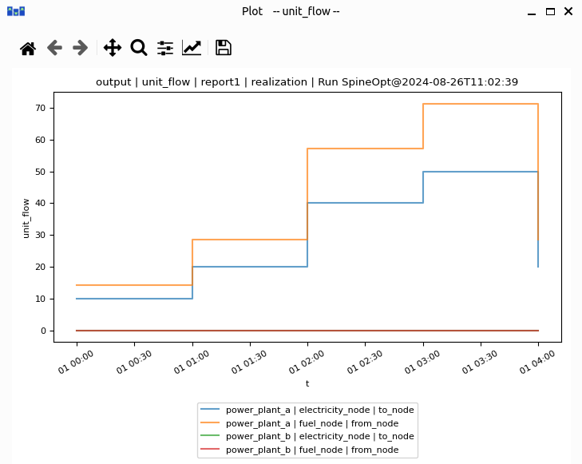
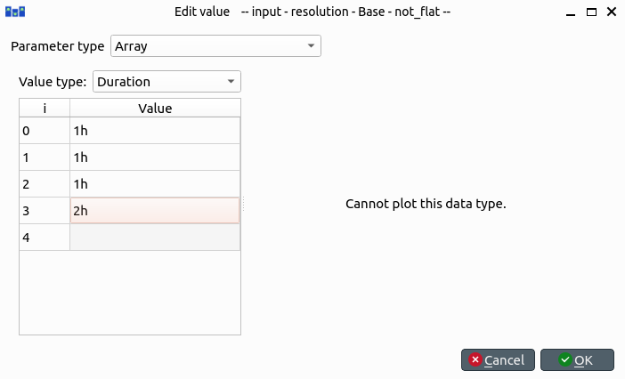
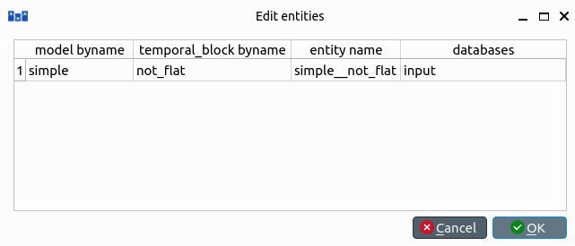
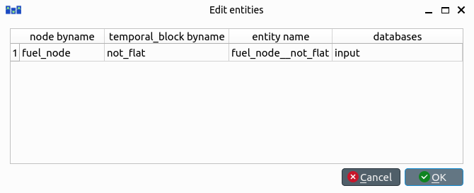
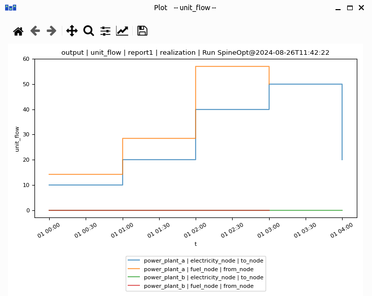

# Temporal Resolution Tutorial

Welcome to Spine Toolbox's Temporal Resolution tutorial.

This tutorial provides a step-by-step guide to include uniform and/or variable temporal resolution in your model.

For more information on how time works in SpineOpt, see the [Temporal Framework](https://spine-tools.github.io/SpineOpt.jl/latest/advanced_concepts/temporal_framework/) documentation.

## Introduction

### Model assumptions 

- This tutorial builds upon the Simple System tutorial. Please follow [that tutorial](https://spine-tools.github.io/SpineOpt.jl/latest/tutorial/simple_system/) first, or download the [finished model](https://github.com/spine-tools/SpineOpt.jl/blob/master/examples/simple_system.json).
- The scenario runs for 5 hours and the default temporal resolution is 1 hour.
- The fuel_node has a temporal resolution of [1, 1, 1, 2] hours.

## Tutorial

### Adjustments to Simple System

Before demonstrating flexible temporal resolution, we need to adjust the Simple System tutorial, so the results are more interesting to examine.

If you have the Simple System project saved, skip to **Adding variable electricity demand**.

If you are starting from scratch:

- File > New Project > Create/Select an empty folder
- Drag and drop a Data Store ("Input"), a Run SpineOpt block, and another Data Store ("Output")

!!! note If you are missing the RunSpineOpt block, go to Plugins > Install Plugin > SpineOpt

Set up the input data:
- Select *Input* and in the *Data Store Properties* window:\
	`Dialect: sqlite`\
	`New Spine db` (button bottom left)\
	`Save` - SpineToolbox will default to a location
- Double click on *InputData* to open the DB Editor
- Select File > Import > Choose the Simple System JSON file you downloaded earlier

Set up the output data:
- Select *Output* and in the *Data Store Properties* window:\
	`Dialect: sqlite`\
	`New Spine db` (button bottom left)\
	`Save` - SpineToolbox will default to a location

Connect the system:
- Click on the white squares to connect the blocks with arrows

SpineOpt has two arguments: 0) Input database connection 1) Output database connection\
Set these arguments:
- Select the Run SpineOpt block and in the *Tool Properties* window:
- Drag and drop `db_url@Input` from *Available resources* to *Command line arguments*
- Then drag and drop `db_url@Output` the same way
- The order matters! Check that it matches the image below

Now your simple system should be set up for running. Try clicking the Execute Project button to see if everything runs properly (all green checkmarks). We'll take a look at the data later.

#### Adding variable electricity demand

In SpineToolbox, double click on the *Input*  block.

!!! note If you are ever missing a window in the Spine DB Editor, go to View and choose the missing window, then drag and resize the window to your preference.

In the *Entity tree* window:
- Expand "node"
- Select the electricity node
- In the *Parameter value* window, find the value for the electricity node's demand (should be 150 from the Simple System) - right click > Edit\
	`Parameter type: Time Series fixed resolution`\
	Copy and paste (or fill in the table):
	
		10
		20
		40
		50
		20

- Click OK - this sets the electricity demand to the variable profile listed above

### Uniform temporal resolution

#### Setting model start & end timestamps

In the *Entity Tree* window:
- Expand the model
- Click on "simple"

In the *Parameter value* window:
- Add model_start \
	`parameter_name:` (Double click) `model_start`\
	`alternative_name:` `Base`\
	`value:` (Right click) Edit > `Parameter Type: Date Time` > `1 Jan` (default)

- Add model_end\
	`parameter_name: model_end`\
	`alternative_name: Base`\
	`value:` Edit > `Parameter Type: Date Time` > 5 hours after start

Your *Parameter value* window show look like this:

!!! note Regularly save your changes by pressing the *Commit button* in the ribbon and pressing commit. For significant changes it is recommended to write a meaningful commit message.

#### Setting 1-hr resolution

In the *Entity tree* window:
- Expand temporal_block
- Select the existing block (should be called "flat" from the Simple System)

In *Parameter value* window: 
- Double click `1D` in the value column
- Change it to `1h`
- Click OK - this changes the time resolution from daily to hourly

Now we have a model that runs for 5 hours with hourly resolution.

- Save the changes (Commit) and return to the SpineToolbox window

#### Running the model & viewing results

- Click Execute Project (play arrow) and wait for the model to run

- Double click the *Output* block

In the *Entity Tree* window:

- Select report_unit_node_direction_stochastic_scenario

Press the *Value* button to see a pivot table which provides a different way to view the data.

In the *Frozen table* window, select the most recent "Run ..." entry

In the *Pivot table* window:
- Click and drag over all `Time series` in the `unit_flow` column, right click > Plot

You should see different colored lines, for the *electricity* and *fuel* flows that are *to* and *from* the powerplants (red and green are on top of each other). The blue line shows the electricity demand of [10, 20, 40, 50, 20] - and how the fuel demand from Powerplant A is this same array divided by 0.7 (the conversion ratio). PowerplantA can handle the demand and is more efficient than PowerplantB, so B does not produce.

### Flexible temporal resolution

#### Creating a time-varying resolution

- Return to the SpineToolbox window and open the *Input* block.

In the *Entity Tree* window:
- Expand the temporal_block\
Notice there's a "flat" temporal block, with the attribute that it's the "model_default_temporal_block"

- Right click on temporal_block and click "Add objects" (or click the '+' icon)\
`entity name: not_flat` > Click OK

In the *Parameter value* window:
- In a new row, set:\
	`entity_byname: not_flat`\
	`parameter_name: resolution`\
	`alternative_name: Base`\
	`value:` Right click > Edit:\
	`Parameter Type: Array`\
	`Value type: Duration`\
	`Value: 1, 1, 1, 2`

The array should look like this: 

In the *Entity tree* window, 
- click on the '+' next to the *model__temporal_block* entity\
	`model: simple`\
	`temporal_block: not_flat`
- click OK\
This tells the model that not_flat is a valid temporal block for the simple model.

Now you have seen how to define a varying temporal resolution. You could give "not_flat" the attribute of "model_default_temporal_block" to change the entire model to this variable resolution - but instead we're going to assign it to a specific entity to show how you can mix resolutions in the same model.

#### Assigning an entity a unique resolution

In the *Entity tree* window:
- Click on '+' next to the *node__temporal_block entity*\
	`node: fuel_node`\
	`temporal_block: not_flat`
- Click OK\
This sets the fuel node's temporal resolution to "not_flat" instead of the default of "flat"

- Save the changes (Commit) and return to the SpineToolbox window

#### Running the model & viewing results

- Rerun the model and view the results like before

See how the yellow line (fuel demand of Powerplant A) now ends at a value of 50, which is equal to the last two demand values averaged over the 2hr window (70 + 30) / 2 = 50.

